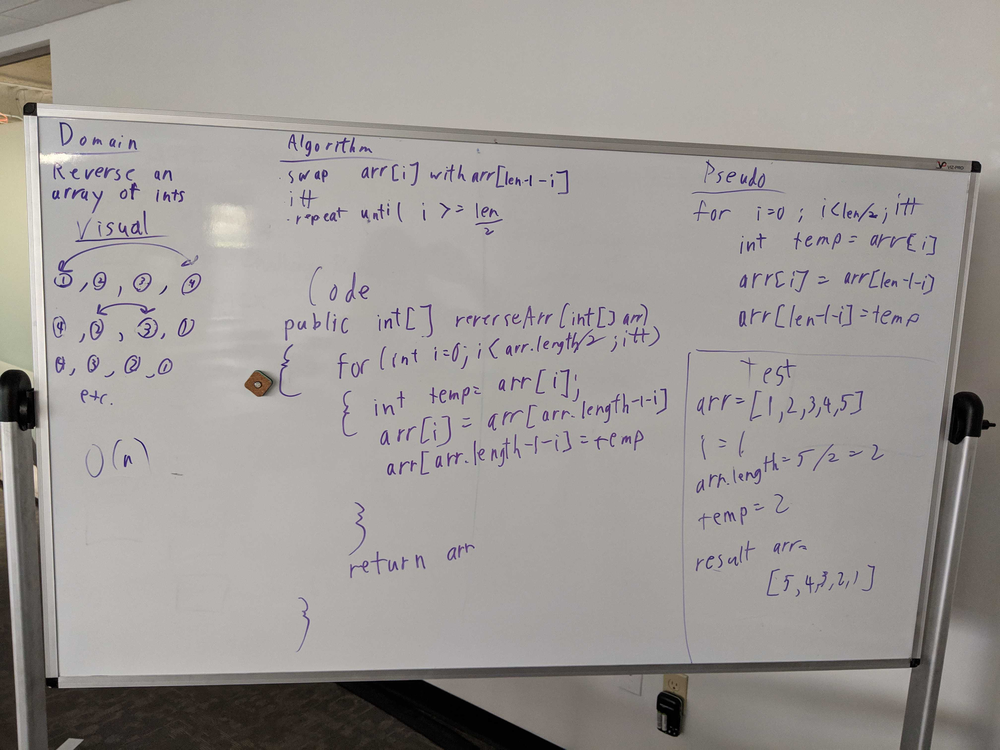
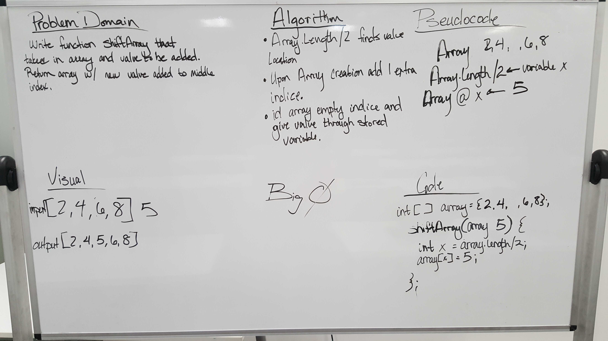
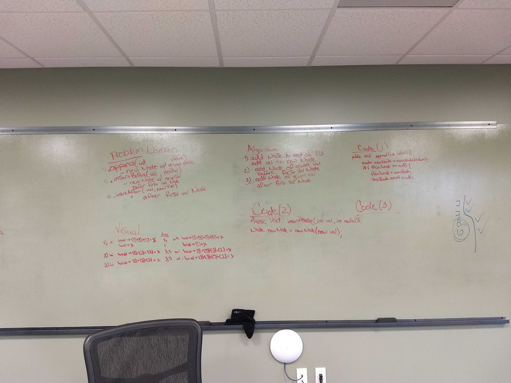
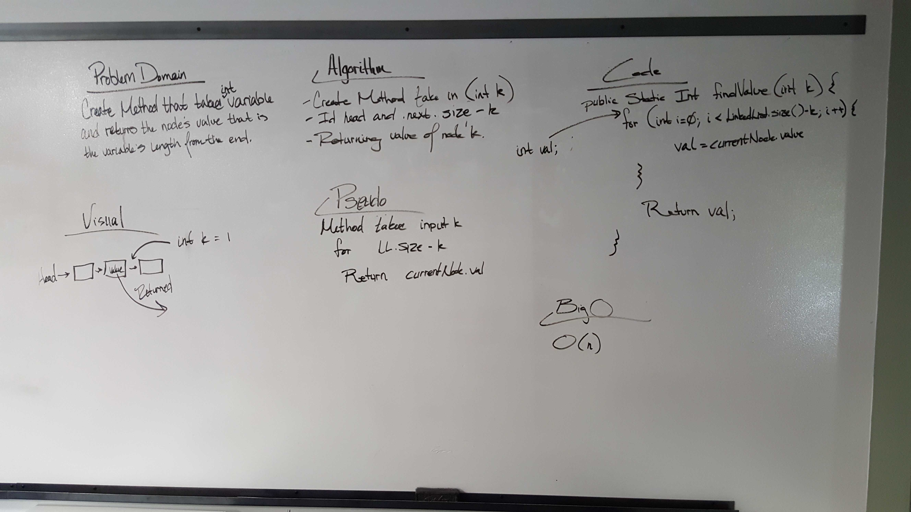
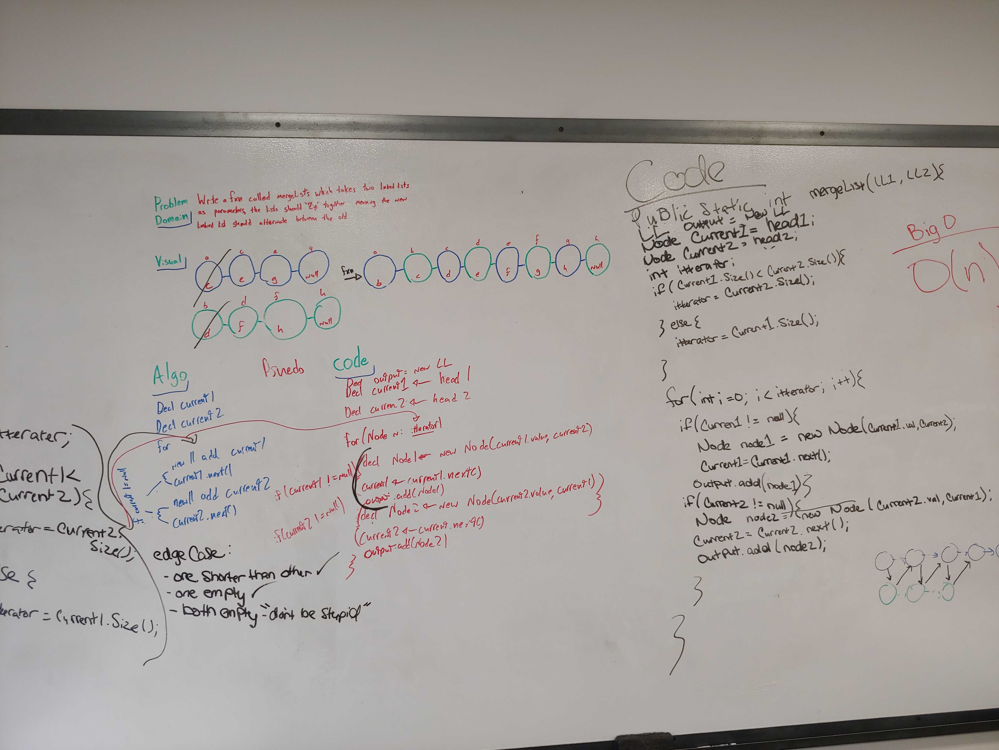
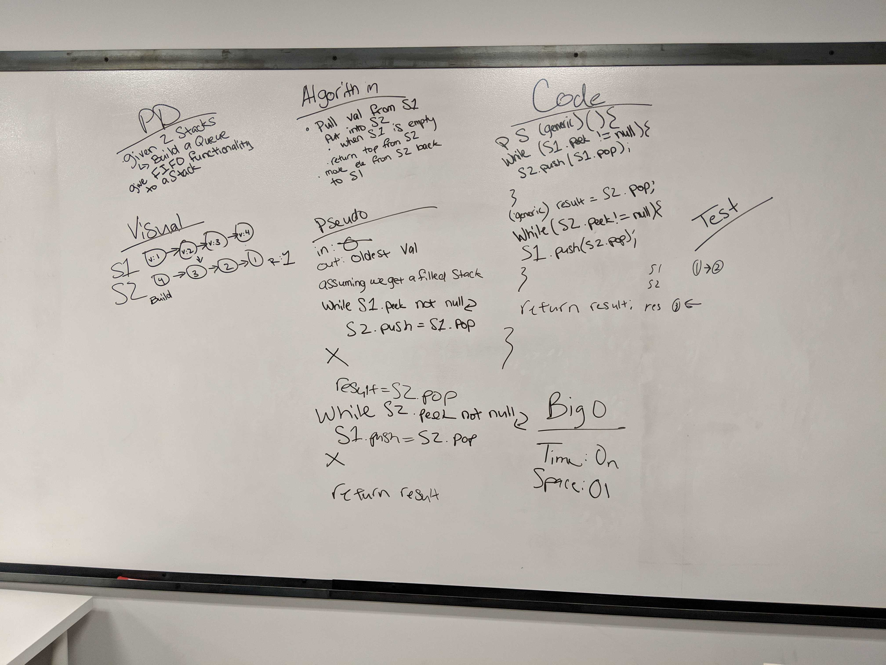

# Data Structures

# Table of Contents
* [Reverse Array](#Reverse)

* [Array Shift](#Shift)

* [Binary Search](#search)

* [Insertions](#insertions)

* [kth from the end](#kth)

* [Merged Linked List](#merged)

* [PseudoQ](#PseudoQ)

## Reverse an Array

We were to take an array, itterate over it, and print out the same array in backwards order.

### Challenge
We were to take an array, itterate over it, and print out the same array in backwards order.

### Approach & Efficiency
<!-- What approach did you take? Why? What is the Big O space/time for this approach? -->
We used a swap value while itterating over the array to output the result.
the Big O: O(n)

### Solution
[reverse array code](../src/main/java/Array_reverse)

## Shift an Array

We were to take an array and a value and place the value directly in the middle of the array given.

### Challenge
We were to take an array and a value and place the value directly in the middle of the array given.

### Approach & Efficiency
<!-- What approach did you take? Why? What is the Big O space/time for this approach? -->
After a bit of trial and error, we created a new array with the length of the origional + 1, then we itterated over the new array, giving the indicies the indicies of the origional while placing the given value at the new array.length/2. 

### Solution
[shift array code](../src/main/java/Array_shift)

## Binary Search

### Challenge
we were to take in a sorted array and a key value, itterate over the array looking for the key vlaue. once found we return the index of the value inside the array, if not found, return -1

### Approach & Efficiency
<!-- What approach did you take? Why? What is the Big O space/time for this approach? -->
we had a for loop that itterated over the array, inside of the foor loop, we have an if statement looking for if the value of the current index is equal to the value of the key. for catching if the value does not exist in the array, we have an else if statement.

### Solution
[Binary Search code](src/main/java/Array_reverse)

## Linked List Insertions

### Challenge
1. 
2. 
3. 

### Approach & Efficiency
<!-- What approach did you take? Why? What is the Big O space/time for this approach? -->
1. 
2. 
3. 

### Solution
[linked list: insertions code](src/main/java/)

## kth from the end of a Linked List

### Challenge
Given a filled linked list, you should be able to run the kth from the end method to return the value of the node k number of times from the end.

### Approach & Efficiency
<!-- What approach did you take? Why? What is the Big O space/time for this approach? -->
We built a for loop that iterates linkedList.size()-k over the linked list, which then returns the value of the node at k.

### Solution
[linked list: kth from end code]()

## Merge two Linked Lists
<a> name="merged"</a>

### Challenge
Take in two linked lists. Merge the two together, alternating between the two original linked list's nodes. Output the head of the linked list.

### Approach & Efficiency
<!-- What approach did you take? Why? What is the Big O space/time for this approach? -->
Initial Approach: After first determining which given linked list has the longer length, we created a for loop that iterates over the two given, adding nodes from each back and forth into a new linked list. 

### Solution
[linked list: merge]()

## Implement a Queue using two Stacks.
<a name="PseudoQ"><a/>
### Challenge
<!-- Description of the challenge -->
Find a way to perform a dequeue on a stack.

### Approach & Efficiency
<!-- What approach did you take? Why? What is the Big O space/time for this approach? -->
We created a holder stack and a primary stack. The result being the bottom of the primary stack. To achieve this we cycled through the primary stack, moving each node from it into the holder stack in reverse order. Then we did a `.pop` on the holder stack, receiving the bottom of the original. We then moved everything back into the original minus the bottom.

### Solution
[pseudoQ](data-structures/src/main/java/stacksAndQueues/PseudoQueue.java)

