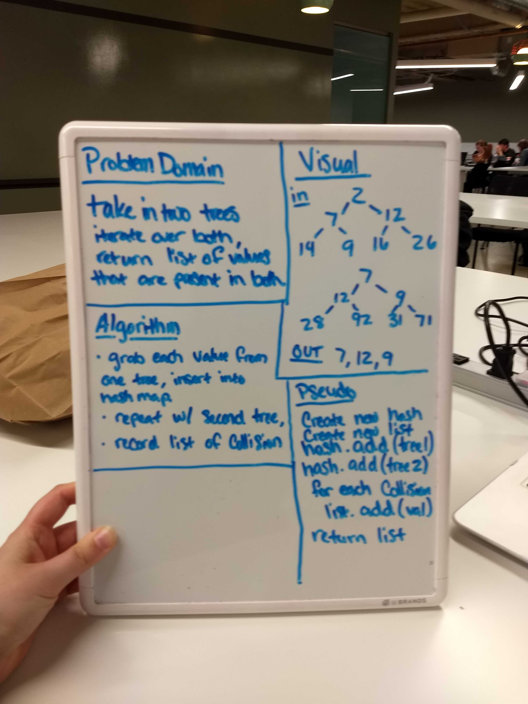
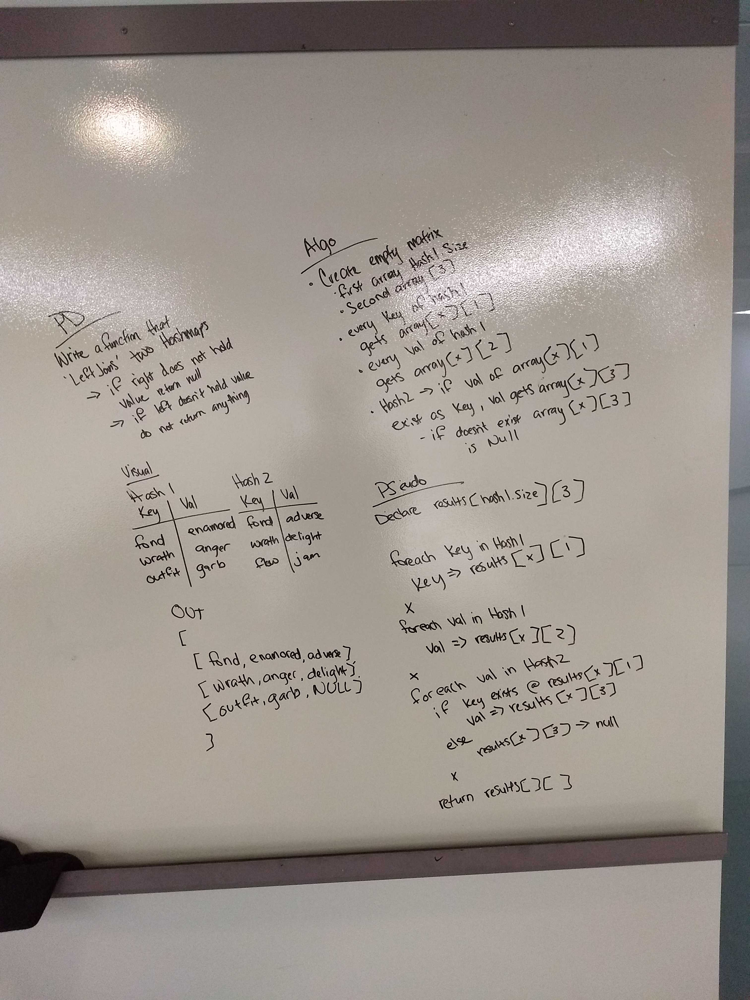
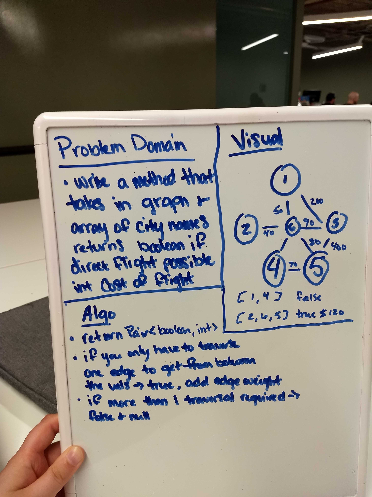

# Data Structures

# Table of Contents
* [Reverse Array](#Reverse)

* [Array Shift](#Shift)

* [Binary Search](#search)

* [Insertions](#insertions)

* [kth from the end](#kth)

* [Merged Linked List](#merged)

* [Stacks and Quques](#sandq)

* [PseudoQ](#PseudoQ)

* [Lecture notes (sorts)](challenges/README.md)

* [Hashset](#hash)

    * [Repeated Word](#repeat)

    * [Tree Intersection](#intersect)

    * [Left Join](#left)

* [Graph](#graph)

    * [Bredth](#bredth)

    * [Direct Flight](#direct)

## Reverse an Array

We were to take an array, itterate over it, and print out the same array in backwards order.

### Challenge
We were to take an array, itterate over it, and print out the same array in backwards order.

### Approach & Efficiency
<!-- What approach did you take? Why? What is the Big O space/time for this approach? -->
We used a swap value while itterating over the array to output the result.
the Big O: O(n)

### Solution
[reverse array code](../src/main/java/Array_reverse)

## Shift an Array

We were to take an array and a value and place the value directly in the middle of the array given.

### Challenge
We were to take an array and a value and place the value directly in the middle of the array given.

### Approach & Efficiency
<!-- What approach did you take? Why? What is the Big O space/time for this approach? -->
After a bit of trial and error, we created a new array with the length of the origional + 1, then we itterated over the new array, giving the indicies the indicies of the origional while placing the given value at the new array.length/2. 

### Solution
[shift array code](../src/main/java/Array_shift)

## Binary Search

### Challenge
we were to take in a sorted array and a key value, itterate over the array looking for the key vlaue. once found we return the index of the value inside the array, if not found, return -1

### Approach & Efficiency
<!-- What approach did you take? Why? What is the Big O space/time for this approach? -->
we had a for loop that itterated over the array, inside of the foor loop, we have an if statement looking for if the value of the current index is equal to the value of the key. for catching if the value does not exist in the array, we have an else if statement.

### Solution
[Binary Search code](src/main/java/Array_reverse)

## Linked List Insertions

### Challenge
1. 
2. 
3. 

### Approach & Efficiency
<!-- What approach did you take? Why? What is the Big O space/time for this approach? -->
1. 
2. 
3. 

### Solution
[linked list: insertions code](src/main/java/)

## kth from the end of a Linked List

### Challenge
Given a filled linked list, you should be able to run the kth from the end method to return the value of the node k number of times from the end.

### Approach & Efficiency
<!-- What approach did you take? Why? What is the Big O space/time for this approach? -->
We built a for loop that iterates linkedList.size()-k over the linked list, which then returns the value of the node at k.

### Solution
[linked list: kth from end code]()

## Merge two Linked Lists

### Challenge
Take in two linked lists. Merge the two together, alternating between the two original linked list's nodes. Output the head of the linked list.

### Approach & Efficiency
<!-- What approach did you take? Why? What is the Big O space/time for this approach? -->
Initial Approach: After first determining which given linked list has the longer length, we created a for loop that iterates over the two given, adding nodes from each back and forth into a new linked list. 

### Solution
[linked list: merge]()

## Stacks and Queues

### Challenge
<!-- Description of the challenge -->
Create a stack and a queue. Within stack, create methods push, pop, and peek. Within queue create methods enqueue, dequque, and peek.

### Approach & Efficiency
<!-- What approach did you take? Why? What is the Big O space/time for this approach? -->
#### For the Stacks
`.push` - push takes in a value. Behind the scenes it creates a new Node with that value, and points it at the current top. This new Node becomes the new top.

`.pop` - pop removes the current top. the pop method then turns the next node into the new top, and returns the value of the removed Node.

`.peek` - to be used before using .push or .pop. peek takes a look at the value of the current top and returns it.

#### For the Queues

`.enquque` - takes in a value. Behind the scenes it cretes a new Node with that value, and points it at the current back, this Node becomes the new back

`.dequque` - dequque removes the current front, it makes the next Node the new front. it then returns the value of the removed Node.

## Implement a Queue using two Stacks.
<a name="PseudoQ"><a/>
### Challenge
<!-- Description of the challenge -->
Find a way to perform a dequeue on a stack.

### Approach & Efficiency
<!-- What approach did you take? Why? What is the Big O space/time for this approach? -->
We created a holder stack and a primary stack. The result being the bottom of the primary stack. To achieve this we cycled through the primary stack, moving each node from it into the holder stack in reverse order. Then we did a `.pop` on the holder stack, receiving the bottom of the original. We then moved everything back into the original minus the bottom.

### Solution
[pseudoQ](data-structures/src/main/java/stacksAndQueues/PseudoQueue.java)

`.peek` - to be used before using .push or .pop. peek takes a look at the value of the current front and returns it.

## Hashtables

[Code](src/main/java/hashtable/Hashtable.java)
<!-- Short summary or background information -->
Implement a Hashtable with the following methods:
`add`, `get`, `contains`, `hash`.

### Challenge
<!-- Description of the challenge -->
Recreate a hashset, with the 3 given methods.

### Approach & Efficiency
<!-- What approach did you take? Why? What is the Big O space/time for this approach? -->
TBD

### API
<!-- Description of each method publicly available in each of your hashtable -->
TBD

## Repeated Word

[Code](src/main/java/RepeatedWord.java)

Write a function that accepts a lengthy string parameter.
Without utilizing any of the built-in library methods available to your language, return the first word to occur more than once in that provided string.

### Challenge
Iterate over the given string, return the first word that gets repeated.

### Approach
TBD

### Solution
TBD

## Tree Intersection

[Code](src/main/java/TreeIntersection.java)

Write a function called `tree_intersection` that takes two binary tree parameters. Without utilizing any of the built-in library methods available to your language, return a set of values found in both trees.

### Challenge
Iterate over the two given trees, return a list of values that are present in both trees.

### Approach

## Left Join

[Code](src/main/java/LeftJoin.java)

Write a function that `leftJoins` two Hashmaps.

   * The first parameter is a hashmap that has word strings as keys, and a synonym of the key as values.
   * The second parameter is a hashmap that has word strings as keys, and antonyms of the key as values.

### Challenge

`LeftJoin` two hashmaps; the output should contain every key/value pair from the first, or *left*, hashmap. The output should also contail the value of the second hashmap if the key exists in the first.

### Approach

I decided to make the `return` value a String matrix. Where the outer array is the length of the *left* hashmap, and the inner arrays have a length of 3.
* First, I ran the *left* hashmap through a foreach, inserting each `key` of it at `resultsArray[x][1]` 
* In the same foreach, I inserted the `value` of the *left* hashmap into `resultsArray[x][2]`
* In an if statement wrapped in another foreach, i checked that the key at `resultsArray[x][1]` exists as a key in the *right* hashmap, if it does then the value gets set at `resultsArray[x][3]`, if it does not then `resultsArray[x][3]` becomes `NULL`

### Solution

## Graph

[Code](src/main/java/graphs/Graph.java)

Create your own graph implementing the following methods:

* `addNode()` - takes in a value, adds a new node with that value to the graph

* `addEdge()` -takes in two (already existing) nodes, and adds a new edge between them

* `getNodes()` - returns a collection of all nodes in the graph

* `size()` - returns the number of nodes in the graph

### Challenge

Implementing a new data structure and it's methods in an understandable way.

### Approach

### Solution

## Bredth

[Code](src/main/java/graphs/Graph.java)

### Challenge

### Approach

### Solution

## Direct Flight

[Code](src/main/java/graphs/Graph.java)

Write a function based on the specifications above, which takes in a graph, and an array of city names. Return whether the full trip is possible with direct flights, and how much it would cost.

### Challenge

Implement a method that can determine if it only takes one edge to get from one node to another; if it takes 1 edge return `true`, if it takes 2=< then return `false`. If you are returning `true`, then total the weight of all edges crossed as the total cost.

### Approach

TBD

### Solution

