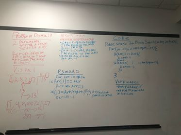

# data-structures

# Table of Contents
[Reverse Array](#Reverse)
[Array Shift](#Shift)
[Binary Search](#search)

## Reverse an Array

We were to take an array, itterate over it, and print out the same array in backwards order.

### Challenge
We were to take an array, itterate over it, and print out the same array in backwards order.

### Approach & Efficiency
<!-- What approach did you take? Why? What is the Big O space/time for this approach? -->
We used a swap value while itterating over the array to output the result.
the Big O: O(n)

### Solution
[reverse array code](challenges/array_reverse/ArrayReverse.java)

## Shift an Array

We were to take an array and a value and place the value directly in the middle of the array given.

### Challenge
We were to take an array and a value and place the value directly in the middle of the array given.

### Approach & Efficiency
<!-- What approach did you take? Why? What is the Big O space/time for this approach? -->
After a bit of trial and error, we created a new array with the length of the origional + 1, then we itterated over the new array, giving the indicies the indicies of the origional while placing the given value at the new array.length/2. 

### Solution

[shift array code](challenges/array_shift/src/main/java/array_shift/App.java)

## Binary Search

### Challenge
we were to take in a sorted array and a key value, itterate over the array looking for the key vlaue. once found we return the index of the value inside the array, if not found, return -1

### Approach & Efficiency
<!-- What approach did you take? Why? What is the Big O space/time for this approach? -->
we had a for loop that itterated over the array, inside of the foor loop, we have an if statement looking for if the value of the current index is equal to the value of the key. for catching if the value does not exist in the array, we have an else if statement.

### Solution
[reverse array code](challenges/BinarySearch/src/main/java/BinarySearch/App.java)

