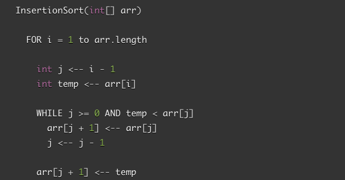

# Insertion Sort

## Learning Objectives

Learn how to build and implement a simple Insertion Sort.

## Lecture Flow

Insertion sort is a simple sorting algorithm, it builds the final sorted array one item at a time. ... On a repetition, insertion sort removes one element from the input data, finds the location it belongs within the sorted list, and inserts it there. It repeats until no input elements remain.

## Diagram
[Insertion Sort Gif](https://gfycat.com/remarkableidenticaladdax)

## Algorithm

* Build an array of a given size (n)

* loop over the array from i = 1 to n-1 

## Pseudocode

## Readings and References

### Watch

[Insertion Sort Video](https://youtu.be/OGzPmgsI-pQ)
 
    GeeksforGeeks

### Read

* [Article 1](https://www.geeksforgeeks.org/insertion-sort/)

* [Article 2](https://www.javatpoint.com/insertion-sort-in-java)
