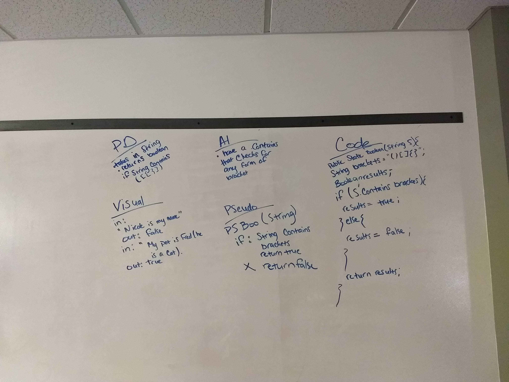

# Multi-bracket Validation.
Your function should take a string as its only argument, and should return a boolean representing whether or not the brackets in the string are balanced. 
## Challenge
Create a method that takes in a String and returns a Boolean value if there are (balanced) brackets within it. 
## Approach & Efficiency
I created a method that takes in a String and, utilizing the `.contains` method and a series of `if` and `if else` statements will return true if teh String contains brackets and those brackets are balanced.

## Solution
[multi bracket validation](MultiBracketValidation.java)

