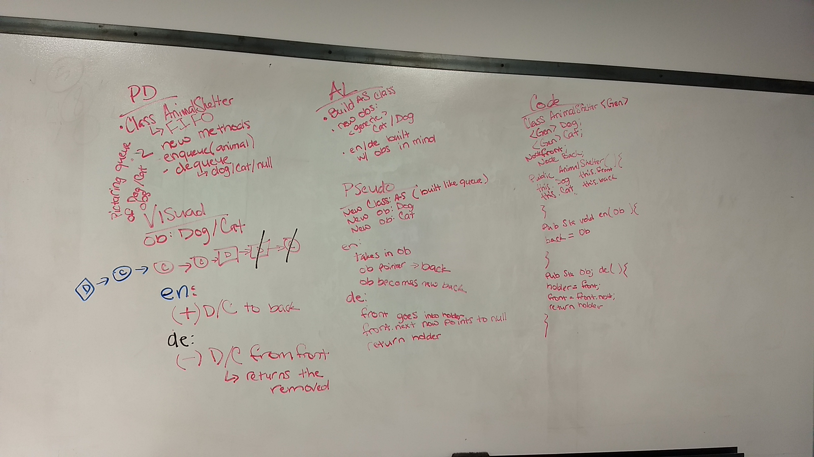

# First-in, First out Animal Shelter.
Create a class called AnimalShelter which holds only dogs and cats. The shelter operates using a first-in, first-out approach.

## Challenge
Create a queue of doges and cats, with an enqueue method and a dequeue method.

## Approach & Efficiency
I created a class of animal that takes in the animal's name and it's type (either a cat or dog). I also created an animal shelter class that holds the enqueue and dequeue methods. 
* `.enqueue` - takes in an animal, when the animal identifies as a cat, it gets placed in the queue holding the cats. When it identifies as a dog, it gets placed in the queue of dogs.
* `.dequeue` - takes in a animal type. When the type given is a cat, it dequeues a cat from the front of the cat queue. When the type given is a dog, it dequeues a dog from the front of the dog queue. If the type given is anything else, then it returns a `null`. 

## Solution
[Animal Shelter Code](FIFOAnimalShelter.java)

