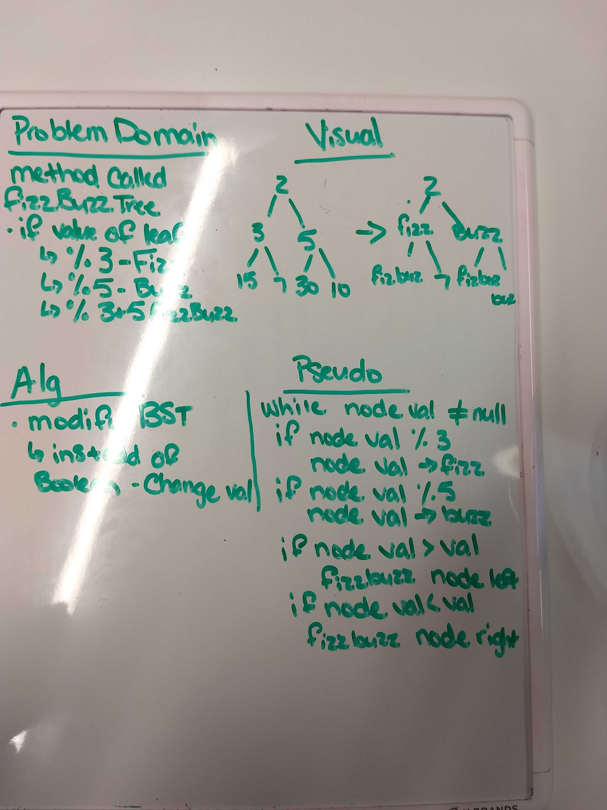
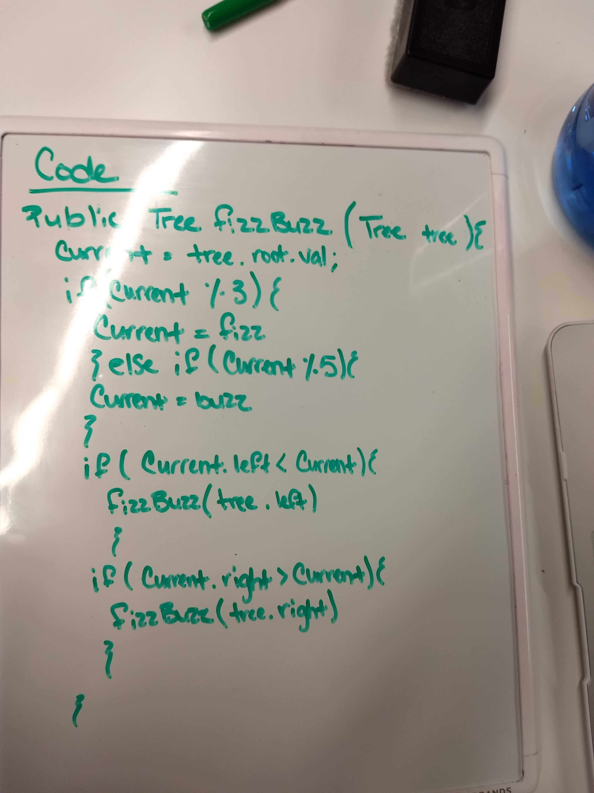
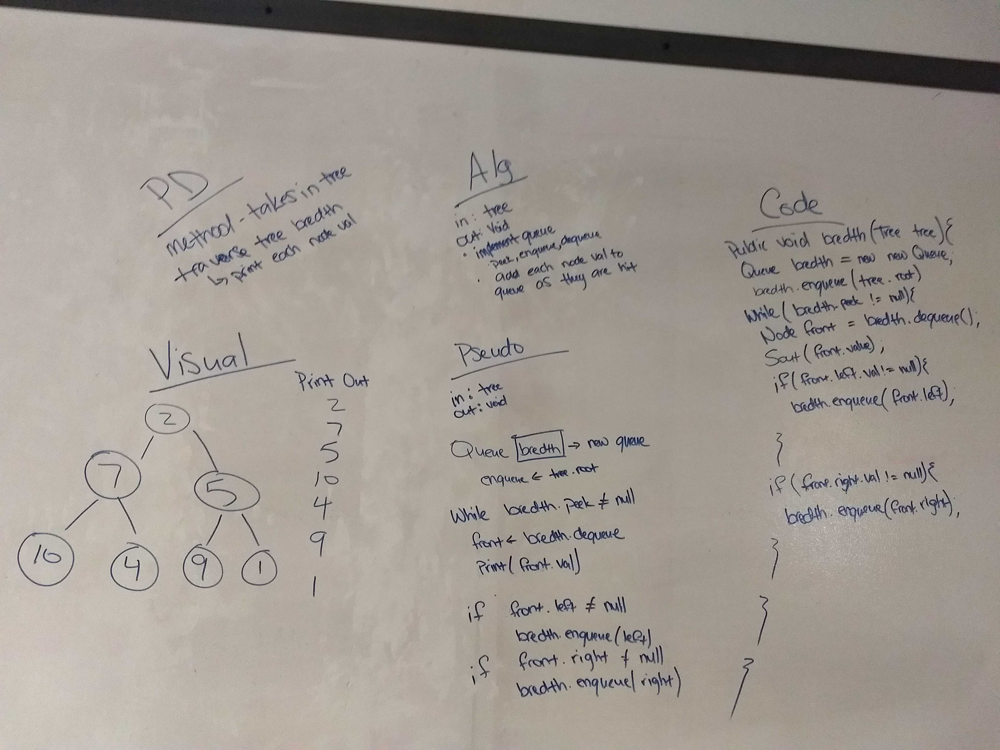

# Trees
<!-- Short summary or background information -->
Create a BinaryTree class. Define a method for each of the depth first traversals called `preOrder`, `inOrder`, and `postOrder` which returns an array of the values, ordered appropriately.

## Challenge
<!-- Description of the challenge -->
Build three methods, each traverses the tree in a different order.

* `preOrder` traverses the tree root => left => right

* `inOrder` traverses the tree left => root => right

* `postOrder` traverses the tree left => right => root

## Approach & Efficiency
<!-- What approach did you take? Why? What is the Big O space/time for this approach? -->
I built three similar methods, the only difference being where root is registered.

# FizzBuzz Tree
Write a function called `fizzBuzzTree` which takes a tree as an argument.
Without utilizing any of the built-in methods available to your language, determine weather or not the value of each node is divisible by 3, 5 or both, and change the value of each of the nodes:
* If the value is divisible by 3, replace the value with “Fizz”
* If the value is divisible by 5, replace the value with “Buzz”
* If the value is divisible by 3 and 5, replace the value with “FizzBuzz”

## Challenge
Develop a method that searches a tree, reads the value, and calculates if it is divisible by 3, 5, or both. Replace the value accordingly.

## Approach & Efficiency
I modified my BST `contains` method. Now instead of returning `true`/`false` when the desired value is found, it now checks to see if the value of the current node is divisible by 3, 5, or both, and if it is, changes the values accordingly.

## Solution

[FizzBuzz Tree](FizzBuzzTree.java)

# Breadth-first
<!-- Short summary or background information -->
Write a breadth first traversal method which takes a Binary Tree as its unique input. Without utilizing any of the built-in methods available to your language, traverse the input tree using a Breadth-first approach; print every visited node’s value.

## Challenge
<!-- Description of the challenge -->
Write a method that takes in a BinaryTree and traverses it breadth first. Meaning each level of the tree, left to right, Node by Node.

## Approach & Efficiency
<!-- What approach did you take? Why? What is the Big O space/time for this approach? -->
I moved my tree into a queue. While it went through the queue, the method would then print out the value of the current front node. The method then recalls itself for the left, then right, going until the tree is complete.

## Solution
<!-- Embedded whiteboard image -->
